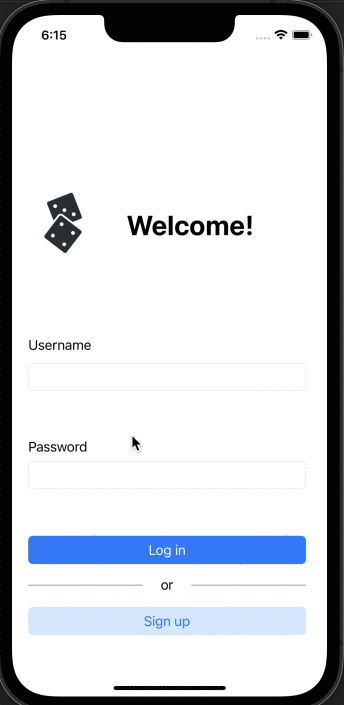

GameNight App Design Project - README
===
## Table of Contents
1. [Overview](#Overview)
2. [Product Spec](#Product-Spec)
3. [Wireframes](#Wireframes)
4. [Schema](#Schema)
5. [Week 1 Progress](#Week_1)
6. [Week 2 Progress](#Week_2)

## Overview
### Description
GameNight is a social networking app that allows board-game enthusiasts to connect with one another, schedule meetups, and grab information on board games.

### App Evaluation

- **Category:** Social Media
- **Mobile:** This app is primarily designed for mobile iOS users, but could work on a computer as well in the future. 
- **Story:** Analyzes user location and board game preferences, and connects them to users in their area or globally (depending on preferences of user). Users can then send messages to each other and schedule a meetup if desired.
- **Market:** Anyone can use this app, but it's made specifically for board-game players, or people that want to start playing. 
- **Habit:** Can be used as frequently as the user desires, depending on how often they'd like to meet new people and/or play board games.
- **Scope:** We'll first start out as an app, with potential for use with online gaming systems, such as Steam, Discord, or DndBeyond.

## Product Spec

### 1. User Stories (Required and Optional)

**Required Must-have Stories**

- [ ] User sees a customized loading screen upon opening app
- [X] User can create an account and log in
- [ ] User can create and delete a game session
- [ ] User can find open games
- [ ] User can see and edit their profile
- [ ] User can view other profiles

**Optional Nice-to-have Stories**

- [ ] User can send and receive messages with other users
- [ ] User must be 18+
- [ ] User history in profile
- [ ] Auto-save and auto-discard

### 2. Screen Archetypes

* Loading Screen
    * GameNight Title
    * 
* Login Screen
   * User is given option to either login or sign up for an account
   * Upon closing the application, the user will stay logged in upon
    reopening
   * 2 Buttons for Forgot Password & Reset Password
* Scrolling Screen to Find Upcoming Meetups
    * TableView
    * TableView Cell - Name of Game, Host Author, Profile Picture.
    * Search bar on top, allows user to scroll through meetups
* Meetup Description Screen 
   * Allows user to view game picture, description, number of players, age range.
   * Place for user to comment
* Meetup Creation Screen
   * Allows user to create a meetup to play a certain game.
   * User can choose from a list of board games or input their own
* Scrolling Screen to find Board Games
   * User can scroll through a list of board games that we've pre-added to the app
* Board Game Description Screen
   * User can view information about board game
* User Scrolling Screen
   * Scrolling view of other users
* User Profile Screen
   * Allows user to view user profile picture and information
   * Edit Button, when clicked -> User Edit Profile Screen
* User Edit Profile Screen 
   * Allows user to upload a photo and fill in information about themselves
   * Button on bottom to save new edit information
* Message Screen (nice to have but not necessary)
   * Allows user to send and receive messages with another user, and return to the messages saved when they exit the chat.
   * Back4App has info on peer-to-peer chat!


### 3. Navigation

**Tab Navigation** (Tab to Screen)

* Scrolling Screen to find Upcoming Meetups
* Profile
* Users
* Board Games
* Top Bar Navigation: Add Profile Picture, Settings on Top.. could base off of reddit's UI
* Search bar on top, nav options (arrow back)


**Flow Navigation** (Screen to Screen)

 * Login -> Show to Scrolling Screen
 * Events -> New Event + on top right will prompt you to create a new meetup
 * New Event -> Events, once finished creating
 * Users -> User profile screen


## Wireframes
[Add picture of your hand sketched wireframes in this section]


## Schema
* User Object


* Session Object 


* Game Object


* Comment Object
 

### Models


### Networking

* Login Screen
   * (Sign-In): Query User database for matching username and password and logs user in if valid
   ```swift
  let username = usernameField.text!
  let password = passwordField.text!

  PFUser.logInWithUsername(inBackground: username, password: password)
      { (user, error) in
          if user != nil {
              self.performSegue(withIdentifier: "loginSegue", sender: nil)
          } else {
              print("Error: \(error?.localizedDescription)")
          }
  }
   ```
 * (Sign-Up): Query User database for non-existing username, and create a new user before logging in
   ```swift
   let user = PFUser()
   user.username = usernameField.text
   user.password = passwordField.text

   user.signUpInBackground { (success, error) in
       if success {
           self.performSegue(withIdentifier: "loginSegue", sender: nil)
       } else {
           print("Error: \(error?.localizedDescription)")
       }
   }
   ```

* Scrolling Screen to Find Upcoming Meetups
   * (READ/GET): Query all posts with a start date = to later than the current date
   ```swift
   let query = PFQuery(className:"MeetupPost")
   query.whereKey("date", greaterThanorEqualTo: currentDate)
   query.order(byDescending: "createdAt")
   query.findObjectsInBackground { meetupPosts: [PFObject]?, error: Error?) in
      if let error = error {
         print(error.localizedDescrption)
      } else if let meetupPosts = meetupPosts {
         print("Successfully retrieved \(posts.count) post.")
         /*Set labels in swift to be equal to data retrieved from the query */
      }

   }
   ```
* Meetup Description Screen 
   * (Create/POST): Create a new comment
   // create the comment
   ```swift
        let comment = PFObject(className: "Comments")
        comment["text"] = text
        comment["post"] = selectedPost
        comment["author"] = PFUser.current()!
        
        selectedPost.add(comment, forKey: "comments")
        
        selectedPost.saveInBackground{ (success, error) in
            if success {
                print("Comment saved.")
            } else {
                print("Comment not saved, error occurred.")
            }
        }
        tableView.reloadData()
        
        // clear and dismiss the input bar
        commentBar.inputTextView.text = nil
        showsCommentBar = false
        becomeFirstResponder()
        commentBar.inputTextView.resignFirstResponder()
   ```
* Meetup Creation Screen
   * (Create/POST): Create a new meetup object
   ```swift
   let meetup = PFObject(className: "Sessions")
   let new_date = Date.init()
   
   meetup["title"] =  title.text
   meetup["typeOfBoardGame"] = genre.text
   meetup["author"] = PFUser.current()!
   meetup["description"] = description.text
   meetup["startDate"] = startDate.text
   meetup["endDate"] = endDate.text
   meetup["createdAtDate"] = new_date
   meetup["updatedAtDate"] = new_date

   sessions.saveInBackground{ (success, error) in
        if success {
             print("Meetup saved.")
        } else {
            print("Meetup not saved, error occurred.")
        }
    }
    ```

* Scrolling Screen to find Board Games
   * (READ/GET): Query all board games in the database
   ```swift
   let query = PFQuery(className: "boardGames")
        query.includeKeys(["title"])
        query.limit = 50
        
        query.findObjectsInBackground{ (posts, error) in
            if games != nil {
                self.games = games!
                self.tableView.reloadData()
            }
            
        }
    ```
* Board Game Description Screen
   * (READ/GET): Query board game object data 
   ```swift
   var query = PFQuery(className:"gameObject")
   var gameObject = query.getObjectInBackgroundWithId("ObjectID")
    ```
   
* User Scrolling Screen
   * (READ/GET): Query user profile pictures & usernames
   ```swift
   var query = PFQuery(className:"user")
   var currUser = query.getObjectInBackgroundWithId("userID")
   var name = currUser["username"]
   var profileImage = currUser["image"]
    ```
* User Profile Screen
   * (READ/GET) Query logged in user object
   ```swift
   var query = PFQuery(className:"user")
   var currUser = query.getObjectInBackgroundWithId("userID")
   ```
* User Edit Profile Screen 
   * (Update/PUT): Update user profile image
   * (Update/PUT): Update user bio
* Message Screen (nice to have but not necessary)

## Week_1



## Week_2 


